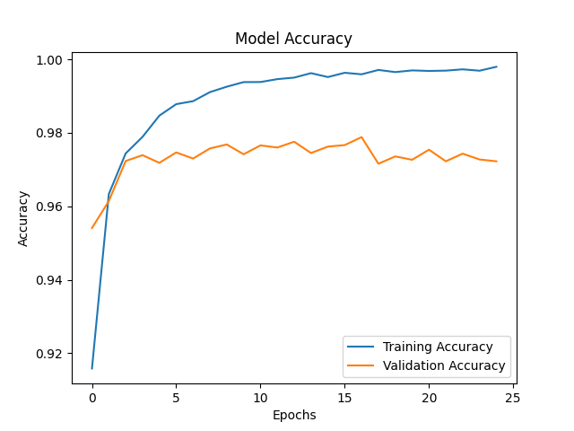
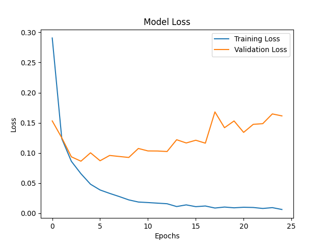

# Handwritten Digit Classification using ANN

This project implements a handwritten digit classification system using an Artificial Neural Network (ANN) trained on the MNIST dataset. The model classifies grayscale images of digits (0–9) using a fully connected neural network built with TensorFlow and Keras.

---

##  Dataset
- **MNIST Dataset**
- 60,000 training images
- 10,000 test images
- Image size: 28×28 (grayscale)

---

##  Model Architecture
- Input layer: 28×28 images
- Flatten layer
- Dense layer with 128 neurons (ReLU activation)
- Output layer with 10 neurons (Softmax activation)

---

##  Technologies Used
- Python
- TensorFlow / Keras
- NumPy
- Matplotlib
- Scikit-learn

---

## Results
- Test Accuracy: **~97.25%**
- Loss and accuracy curves show stable convergence
- Model generalizes well on unseen test data

---

## Training Performance

### Accuracy Curve


### Loss Curve


After around 10 epochs, training loss keeps decreasing while validation loss starts increasing, indicating overfitting. This happens because ANNs do not preserve spatial features in images. CNNs handle this better.
---

##  Sample Predictions
Below are sample predictions made by the trained model:


---

##  How to Run

1. Clone the repository
```bash
git clone https://github.com/MohdSaadMa07/handwritten-digit-classification-ann
